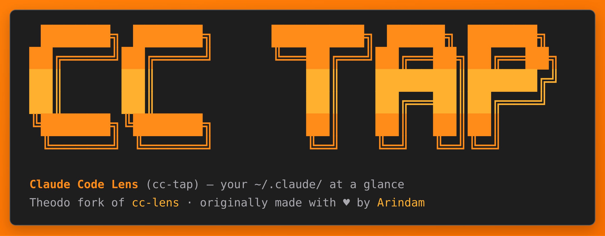

# Claude Code Lens (cc-tap)

> **This is a Theodo Group fork of [Arindam200/cc-lens](https://github.com/Arindam200/cc-lens).**
> It adds a real-time **Live Capture** view of the raw requests Claude Code sends to
> `api.anthropic.com` — system prompt, tool schemas, cache breakpoints, message history,
> response. Useful for debugging unexpected Claude Code behavior and for understanding how
> the CLI assembles its context window.

Local analytics dashboard for Claude Code. No cloud, no telemetry, just your `~/.claude/` data, visualized.

```bash
npx cc-tap
```

> Published to npm as **`cc-tap`** (the `cc-lens` name was taken). The CLI runs a
> prebuilt standalone bundle, so it boots instantly with no install or compile step.

The CLI finds a free local port, starts the dashboard, and opens it in your browser.

## What You Can See

### Overview

<picture>
  <source media="(prefers-color-scheme: dark)" srcset="./public/dashboard-dark.png" />
  <source media="(prefers-color-scheme: light)" srcset="./public/dashboard-white.png" />
  
</picture>

- Sessions, messages, token usage, estimated cost, and local storage.
- Trend cards with sparklines.
- Date presets for 7, 30, and 90 days, plus a custom date range picker.
- Usage over time, model distribution, peak hours, project activity, token breakdown, and recent sessions.

### Projects


- Searchable, sortable project grid.
- Per-project cards with sessions, duration, estimated cost, languages, git branches, MCP/agent badges, and top tools.
- Project detail pages with sessions, cost over time, language distribution, branch activity, and tool usage.

### Sessions


- Searchable session table with badges for compaction, agents, MCP, web search/fetch, and extended thinking.
- Full session replay reconstructed from JSONL.
- Assistant responses rendered as GitHub-flavored Markdown.
- Tool calls and tool results shown inline.
- File read/write/update tool results parsed into readable cards.
- Per-turn model, duration, token breakdown, and estimated cost.
- Compaction events shown in context with a token accumulation chart.

### Live Capture


- Click **Live Capture** in the top bar → **Start**, then run Claude Code with:

  ```bash
  OTEL_LOG_RAW_API_BODIES=file:$HOME/.cc-lens/otel-bodies claude
  ```

  Claude Code keeps talking to `api.anthropic.com` as usual and writes each request and response body to that directory; cc-tap records them and deletes the files once recorded. To capture every session, set the variable in the `env` of `~/.claude/settings.json` (with the absolute path: `$HOME` is not expanded there). Files written while capture is stopped are picked up at the next **Start**.
- The **Live** page shows a real-time tail of every Anthropic API request with a side-by-side anatomy view: system prompt with cache breakpoints, tool schemas, message history, response.
- Captures are correlated to JSONL sessions automatically and also surface under a **Raw API** tab on each session page; data is gzipped to `~/.cc-lens/payloads/` with a SQLite index.
- What cc-tap adds from the session JSONL: the thinking text (Claude Code logs it as `<REDACTED>`), and failed attempts — each retried or abandoned call with its status (429, 529, connection reset…), matched to its request body by time. A request with no response and no recorded failure (e.g. interrupted with Esc) shows up after 15 minutes without a status.
- Limits of this mode: only `/v1/messages` calls are recorded, and a streamed response is rebuilt from the final message (labeled **reconstructed** in the Raw SSE view), not the stream as sent. The session JSONL is looked up under `CLAUDE_CONFIG_DIR` (default `~/.claude`) as seen by the dashboard.

**Proxy mode (advanced).** The same popover can start a local reverse proxy instead; run `ENABLE_TOOL_SEARCH=true ANTHROPIC_BASE_URL=http://localhost:<port> claude` (the snippet with the right port is copyable). It records the wire traffic: the SSE stream as sent, calls besides `/v1/messages`, the exact status and timing of every attempt. But a custom `ANTHROPIC_BASE_URL` changes how Claude Code behaves — tool search is off unless `ENABLE_TOOL_SEARCH=true`, auto mode adds its safeguards and security-monitor calls, the beta headers differ — so captures may not match a normal session.

## Project Docs

- [Roadmap](./docs/ROADMAP.md): planned improvements and non-goals.
- [Known limitations](./docs/LIMITATIONS.md): accuracy, compatibility, and runtime caveats.
- [Compatibility](./docs/COMPATIBILITY.md): supported local files and reporting guidance.
- [Contributing](./docs/CONTRIBUTING.md): local setup, PR expectations, and manual test notes.
- [Privacy](./docs/PRIVACY.md): what data is read, exported, or edited.
- [Security](./docs/SECURITY.md): private vulnerability reporting and review checklist.

## Data Sources

`cc-tap` reads local Claude Code files directly:

- `~/.claude/projects/<slug>/*.jsonl`: session JSONL and replay data
- `~/.claude/projects/<slug>/<session>/subagents/`: sub-agent transcripts, including `workflows/wf_*/` for Workflow runs
- `~/.claude/projects/<slug>/<session>/workflows/`: Workflow run records and persisted scripts
- `~/.claude/stats-cache.json`: aggregate stats when available
- `~/.claude/usage-data/session-meta/`: session metadata fallback
- `~/.claude/history.jsonl`: command history
- `~/.claude/todos/`: todo files
- `~/.claude/plans/`: saved plan files
- `~/.claude/projects/*/memory/`: project memory files
- `~/.claude/settings.json`: settings, skills, plugins, and MCP config

Dashboard data refreshes every 5 seconds while the app is open.

## Cost Estimates

Claude Code stores token counts and model identifiers, not final billing totals. `cc-tap` estimates cost using the pricing table in `lib/pricing.ts`. If provider pricing changes, update that file to keep estimates current.
